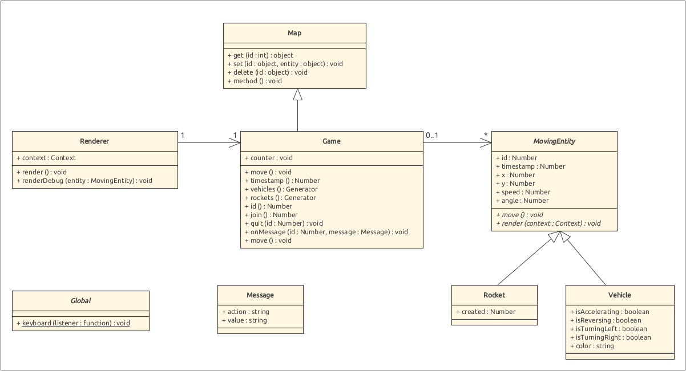

# Exercise 4

You are asked to improve the `Game` class and to implement and test the `keyboard(listener)` function. 
Notice that some design decisions, such as the introduction of a `Message` class, depend on the multiplayer features that will be implemented in the future assignments.



## Message class

The `Message` class corresponds to the inputs generated by the user when pressing the keyboard.
They are generated by the `keyboard(listener)` function and handled by the `Game.onMessage(id, message)` method.
Later on, messages will be serialized and transmitted over the network.

## Game class

The `Game` class extends the `Map` class to store moving entities. 
The identifiers (`id`) of the moving entities act as keys in the map. 
Hence, the `set(id, entity)`, `get(id)` and `delete(id)` methods provided by the `Map` class can be used in the `Game` class to manage the moving entities during their lifecycle. 
You are asked to implement several methods in the `Game` class according to the tests provided in `test/game.js`. 
The tests are provided as guidelines and do not cover all the corner cases.

## Keyboard function

In JavaScript, pressing a key results in several successive `keydown` events, i.e., consecutive events are triggered until the key goes up again (`keyup` event). 
The `keyboard` function is responsible for listening to the keybord (with `window.addEventListener`), for stopping the propagation of events, and for filtering duplicated events. 
The parameter of the `keyboard` function is a `listener` function that takes a `message` as a parameter.
A `message`is an instance of the `Message` class created with the `event.type` and `event.key` properties of a keyboard event.
You can use the Set class of the standard library to filter consecutive events. 
You are asked to implement the `keyboard(listener)` function and to provide meaninful unit tests in the `test/keyboard.js` file and a few line of documentation explaining your choices.

## Evaluation

All your modifications should take place in the files `src/game.js`, `src/keyboard.js`, and `test/keyboard.js` files, which contain TODO placeholders. 
For the corrections, we will check that your project passes the provided tests.
Additionally, we will read the tests you created and visually verify in the browser that the game behaves as in the demonstration.

## Prerequisites

- Node 16 (LTS)

## Setup

Install project dependencies
```sh
npm install
```

Start the server
```sh
npm run start

# or start server in watch mode
# so it automatically restarts on file changes
npm run watch
```

Run tests
```
npm run test
```

> See more in the `scripts` section of your [package.json](./package.json).